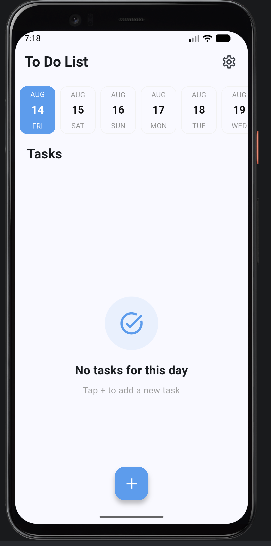
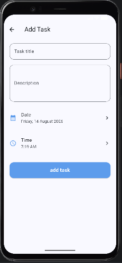
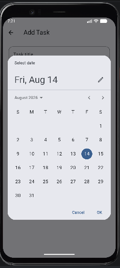
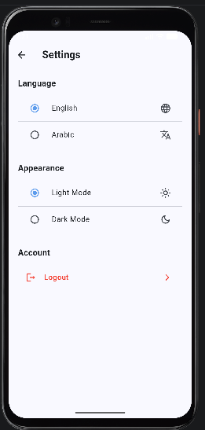

# 📝 Todo App - Flutter

A Todo mobile application built with Flutter and Dart, designed to help users create, manage, and organize their daily tasks through a clean and simple interface.

## ✨ Features

- 🔐 User Sign Up & Login
- ✅ Create and manage tasks
- ✏️ Edit existing tasks
- 🗑️ Delete tasks
- 📅 Select task dates
- ⏰ Select task times
- 📆 Browse tasks by date
- 🌙 Light & Dark Mode
- 🌍 Arabic & English language support
- 💾 Local task storage
- ✔️ Mark tasks as completed
- 📱 Clean and responsive mobile UI

## 🛠️ Tech Stack

- Flutter
- Dart
- Provider – State Management
- Hive & Hive Flutter – Local Data Storage
- Shared Preferences – Local Preferences Storage
- Easy Localization – Arabic & English Localization
- Table Calendar & Easy Date Timeline – Date Management & Selection
- Flutter Slidable – Task Actions & Interactions
- Google Fonts – Custom Typography
- Intl – Date & Time Formatting
- Material Design
  ## 📱 Screenshots

### 🏠 Home Screen


### 📋 Task Screen


### 📅 Calendar


### ✏️ Delete & Edit


### ⚙️ Settings


### 🌙 Dark Mode


## 📂 Project Structure

```text
lib/
├── core/
│   ├── colors/
│   └── theme/
├── models/
├── providers/
├── screens/
│   ├── auth/
│   ├── home/
│   ├── add_task/
│   ├── settings/
│   └── splash/
├── services/
├── widgets/
└── main.dart
